# Offensive Security - Penetrations Testing Bootcamp

## Day 1 – What is penetration testing

**2022 Data Breach**

Investigations Report

https://www.verizon.com/business/en-gb/resources/reports/dbir/

**Public Pentesting Reports**

https://github.com/juliocesarfort/public-pentesting-reports

**Frameworks**

- ISSAF - Information Systems Security Assessment

- OSSTMM - Open Source Security Testing Methodology Manual

- OWASP - Open Web Application Security Project

- MITRE ATT&CK

---

## Day 2 – Creating your own pentesting lab

**Update 'locate' DB**

```
sudo updatedb
```

**Locate file / program**

```
locate -i rockyou
```

**Locate Software**

```
which burpsuite hydra
```

**Find command (Active Search)**

```
find  / rockyou
```

**Find by permission**

```
find / -maxdepth 5 -type f -name "test" -pem 0227
```

**Find modify files last 5 days**

```
find / -maxdepth 5 -type f -atime 5
```

**See Network Connections**

```
netstat
```

**Make all lowercase**

```
cat names.txt | tr '[:upper:]' '[:lower:]'
```

**Add www**

```
cat names.txt | tr '[:upper:]' '[:lower:]' | head -n 20 | dos2unix | awk '$0="www."$0".com"'
```

**Host Information**

```
host srf.ch
```


**IP Information of domains**

```
for i in `cat first-names.txt | tr '[:upper:]' '[:lower:]' | head -n 20 | dos2unix | awk '$0="www."$0".com"'`;do host $i | awk '/has address/ { print $4 }';done
```


**Python Class**


**Pass a command output to a python script:**
https://stackoverflow.com/a/17658680

**IDE de Python  - para desarrolladores profesionales**

https://www.jetbrains.com/es-es/pycharm/

---

## Day 3 – Information Gathering

**Google Hack to find camera**

```
camera linksys inurl:main.cgi
```

**Search for in title**

```
intitle: "TOSHIBA Network Camera - User Login"
```

**Find Vunerability Software**

```
"SquirrelMail version 1.4.1" ext:php
```

```
intitle:"Welcome to Windows Small Business Server 2003"
```

**Find Password**

```
ext:pwd inurl:(service | authors | administrators |users)  "frontpage"
```

**Search for password.txt**

```
intitle: index of /* password.txt
```

[Google Hacking Database (GHDB) - Google Dorks, OSINT, Recon](https://www.exploit-db.com/google-hacking-database)

--- 

**In Kali**

```
host -t ns google.com
```

```
host -t txt google.com
```

```
 nslookup -type=ns google.com
```

```
 nslookup -type=soa google.com
```

```
 nslookup -type=mx google.com
```

```
dig google.com 
```

```
dig google.com A
```

```
 dig google.com any
```

```
 dig -x google.com +short 
```

```
dnsenum
```

**nmap**

```
nmap 10.211.55.7  -p25
```

**Acknowledge Package Send**

```
nmap -sA 10.211.55.7  -p25
```

**Christmas (all Flags)**

```
nmap -sX 10.211.55.7 -p25
```

**No Flags**

```
nmap -sN 10.211.55.7 -p25
```

**UDP Package**

```
nmap -sU 10.211.55.7 -p25
```

---

**hping3 - send (almost) arbitrary TCP/IP packets to network hosts**

man hping3

```
sudo hping3 --traceroute -V -1 10.211.55.7
```

**Check Port 80**

```
sudo hping3 --traceroute -V -1 -p80 10.211.55.7
```

**DDoS Attack**

```
hping3 -1 --flood 10.211.55.7
```

**nmap see top 1000 ports**

```
nmap 10.211.55.7 
```

**smbmap**

```
smbmap -H 10.211.55.7 
```

**rpcclient**

```
rpcclient -U ""  -N 10.211.55.7
```

**smbclient**

```
smbclient -L 10.211.55.7
```

enum4linux

```
enum4linux -h
```

enum4linux all enumeration for default user pw & configs

```
enum4linux -a 10.211.5.10
```

**onesixtyone (snmp scan)**

```
onesixtyone -c /usr/share/doc/onesixtyone/dict.txt 10.211.5.10
```

**snmpwalk**

```
snmpwalk -c public 10.211.5.10 -v 1
```

**snmpset**

```
snmpset 10.211.5.10
```

**dirb**

```
dirb http://10.211.5.10
```


**Dirbuster vulns IIS Webserver**

```
dirb http://10.211.5.10 /usr/share/dirb/wordlists/vulns/iis.txt
```

**nikto web vulns scanner**

```
man nikto
```

```
nikto -h 10.211.55.7
```


**Vuln Scan with nmap**

```
nmap -v --script vuln 10.211.55.7
```

---

**Often you have to adjust vulnerability scripts**

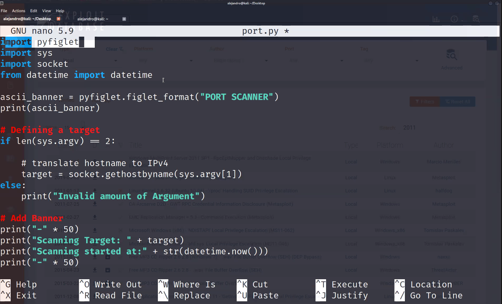


**Optional Homework**
Install Metasploitable: 1
[Metasploitable: 1 ~ VulnHub](https://www.vulnhub.com/entry/metasploitable-1,28/#top)

**How to install Metasploitable 1 in Virtual Box**

[Installing Metasploitable in VirtualBox - Hackercool Magazine](https://www.hackercoolmagazine.com/installing-metasploitable-in-virtualbox/)

----

## Day 4 – Pentesting tools


```
nc 10.211.55.8 22
```


**Find Exploit for this OpenSSH Version**

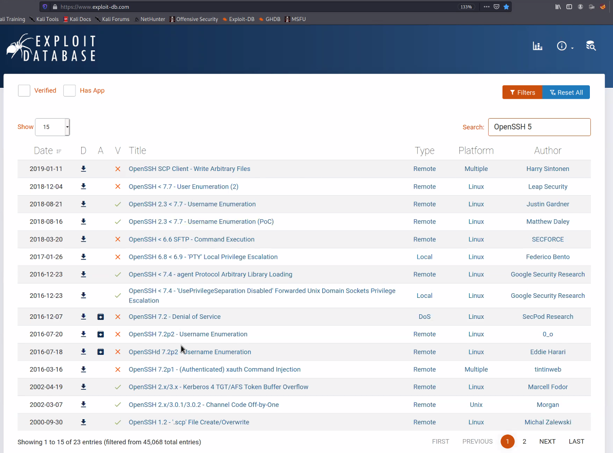


**Import own portscanner class:**


**Own "small" vuln database:**


**Run Script:**


**pyExploitDb Library**


[pyExploitDb · PyPI](https://pypi.org/project/pyExploitDb/)

**Downloaded exploits in kali**

```
ls /usr/share/exploitdb 
```

**Show Banners from Ports**

```
nmap -sV 10.211.55.8
```


```
nmap -h | grep PS
```

[Timing Templates (-T) | Nmap Network Scanning](https://nmap.org/book/performance-timing-templates.html)

**Default Scan Timing**

```
nmap -T3 10.211.55.8
```

**Very Slow Scan**

```
nmap -T1 10.211.55.8
```

**Very Fast Scan**

```
nmap -T5 10.211.55.8
```

**nmap vuln scripts**

```
ls /usr/share/nmap/scripts | grep ssh
```


**Automated Scan for smb**


**Use all scripts**

```
nmap --script all 10.211.55.8
```

**Netcat (Swiss Army Knife for Network Connection)**

```
nc 10.211.55.8 80
```

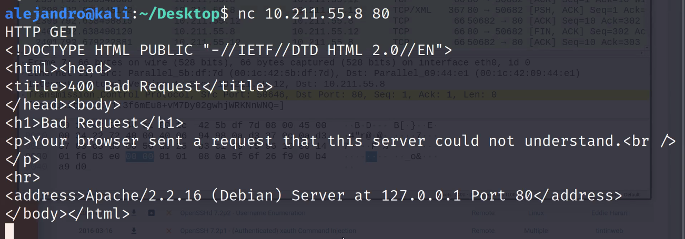

Write 

```
HTTP GET
```

and enter

**Run netcat as server**

```
nc -nlvp 4444
```

**Exfiltrate Data**


**Received**

**How it looks in Wireshark**


**Exfiltrate File**


> If someone connect to this Server, he will get content from port.py


**Give full controll on this Windows Machine**


**On Kali you own now this Windows Machine**

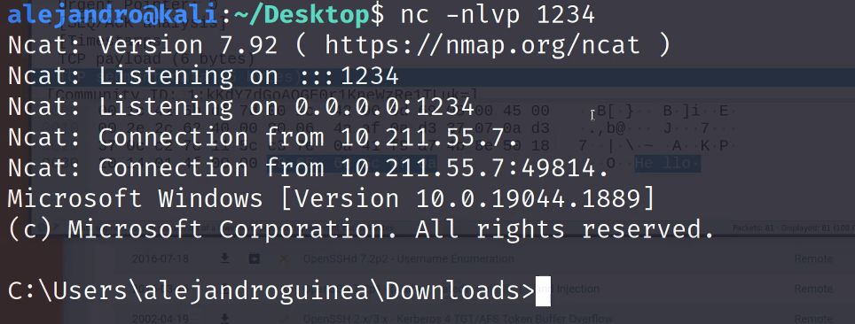

**Run Wireshark independet in terminal with &**

```
wireshark&
```

**Unencrypted netcat session (SIM / Next Generation Firewall will detect you)**

```
ncat -nvlp 4444
```

**netcat via SSL encryption**

```
ncat -nvlp 4444 --ssl
```


**Reverse Shell Generator**

https://www.revshells.com/

**Reverse Shell on von Linux Machine**


**Windows now has access to this Linux Machine**


**Snort 3**

> Install snort 3 via Docker on your Kali (Currently best way)

https://hub.docker.com/r/ciscotalos/snort3

> Snort can combine with Wireshark. Also can Scan .pcap files

**Snort Basic Cheatsheet**

https://snort-org-site.s3.amazonaws.com/production/document_files/files/000/000/116/original/Snort_rule_infographic.pdf

**Install Snort 2**

https://bin3xish477.medium.com/installing-snort-on-kali-linux-9c96f3ab2910

**Snort Config Path**

```
/etc/snort/snort.conf
```

**Snort Custom Rules**


**Snort Alert Logs**

```
sudo cat /etc/snort/log/snort
```


**See active Network Connections**

```
netstat -antp
```


**Rules & Log Output**


**Send data via netcat on port 4444**

```
printf "test" | nc <IP> 4444
```

**Dump Network Traffic via Command Line**

```
sudo tcpdump -x -X -i eth0 `port 4444` 
```

**Or via Wireshark command line version**

```
sudo tshark -V -i eth0
```

**Decrypt SSL Keys**

```
touch /home/kali/Desktop/ssltlskeys.log
export SSLKEYLOGFILE=/home/kali/Desktop/ssltlskeys.log
echo $SSLKEYLOGFILE
google-chrome&
sudo wireshark&
```


**In Wireshark**

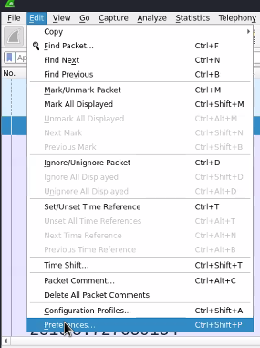


**Now Traffic is unencrypted**

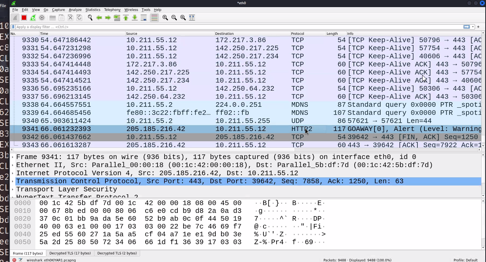

**Analyse pcap in snort**


---

## Day 5 – Creating your own exploits

> Question regarding Google hacks. Does anyone know a Google hack to get all websites with a specific word in the domain name (not url)? For example, I want all websites with the word "saturn", but only websites where "saturn" is in the domain name, e.g., www. saturn.com, www.saturncoffee.com. What I don't want is www.astronomy.com/planets/ringed-planets/saturn.html

```
https://github.com/elceef/dnstwist
```


```
nmap -sV 10.211.55.7
```

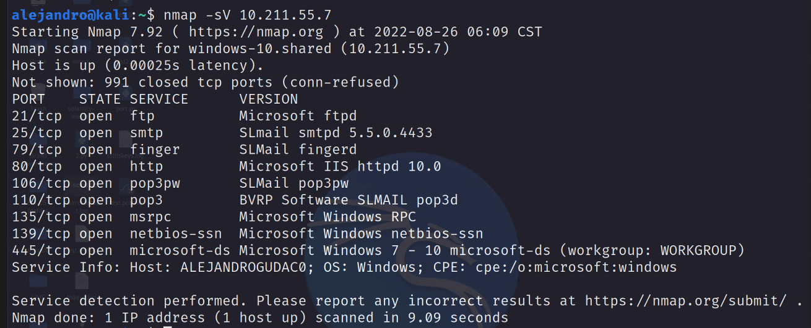


- https://www.cvedetails.com/

- https://www.exploit-db.com/


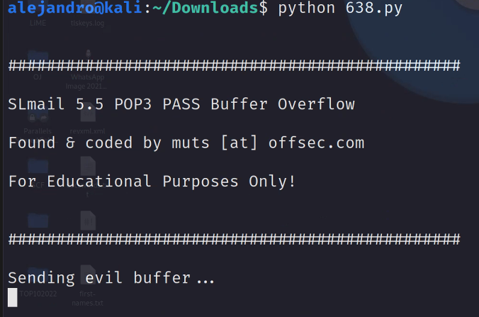

```
netstat -ano | find 4444
```


```
nc 10.211.55.7 4444
```


**Download & rename exploit via wget**

```
wget https://www.exploit-db.com/download/42315 -O eternal2016.py
```

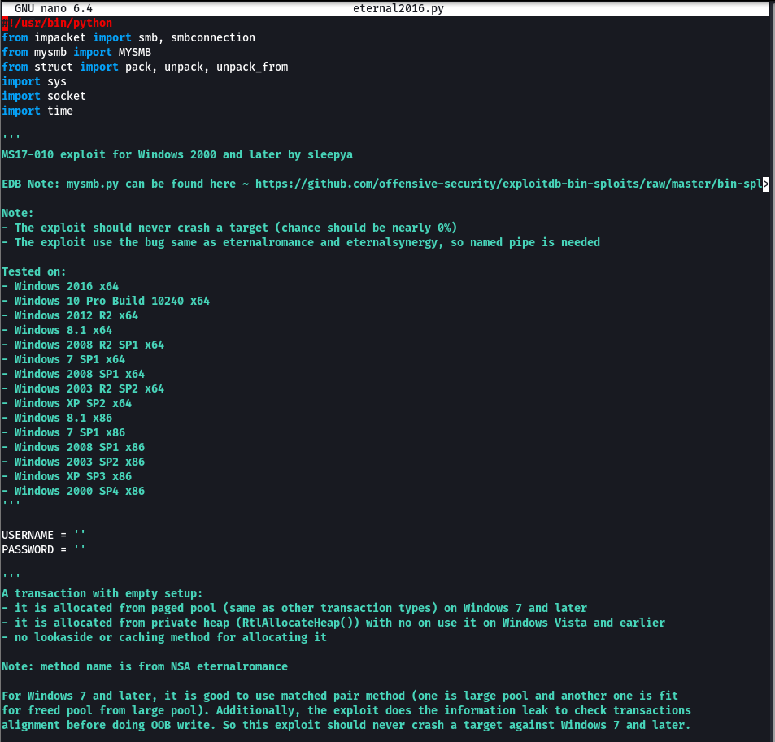

**Find Payload**


**Our new Payload: <mark>Create new user</mark>**


**<mark>Bottom two screenshots can be ignored (Exploit didn't work in end)</mark>**

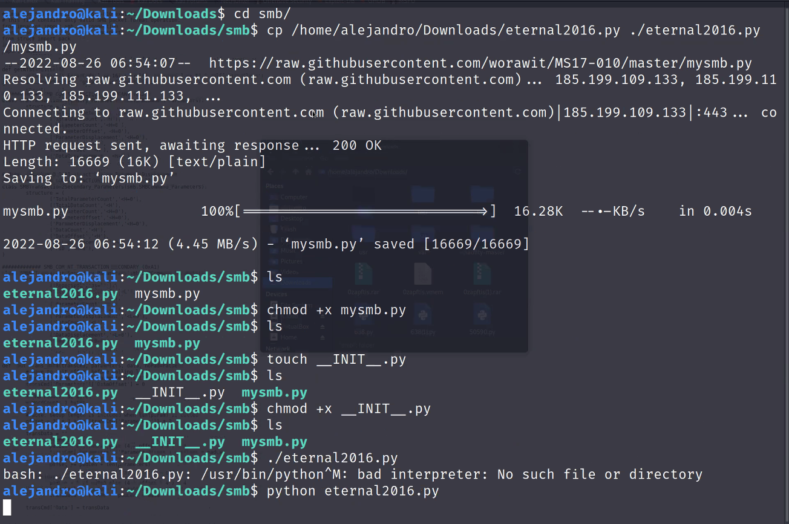


**Metasploit**


**Interview with Metasploit Founder:**
https://darknetdiaries.com/episode/114/


```
mfsconsole
```

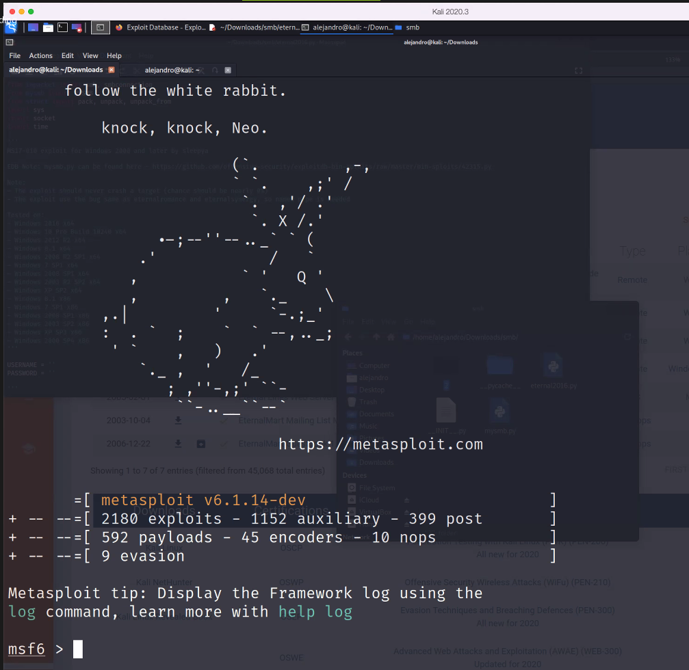


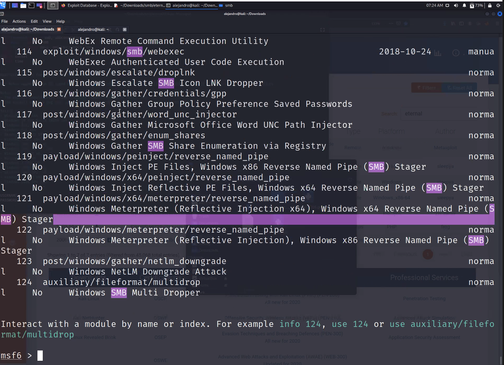


**GUI for Metasploit**

```
sudo apt-get install artimage
```

```
sudo armitage
```

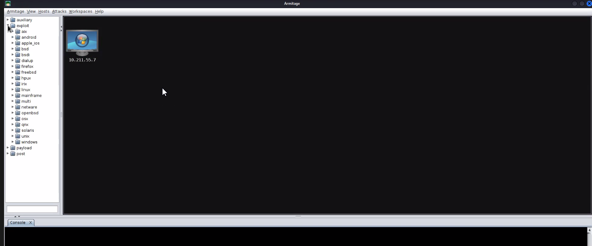


Check out what what intressting tools Alejandro has ;-) 


**Create own Payload**


**Vulnhub:  Mr-Robot: 1**

https://www.vulnhub.com/entry/mr-robot-1,151/


**Find Bufferoverflow**


**Course Recommendation: The External Pentest Playbook**

https://academy.tcm-sec.com/p/external-pentest-playbook
