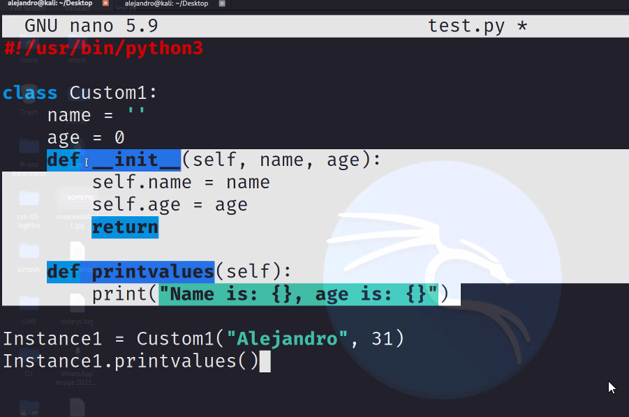

# Offensive Security - Penetrations Testing Bootcamp

## Day 1 – What is penetration testing

**2022 Data Breach**

Investigations Report

https://www.verizon.com/business/en-gb/resources/reports/dbir/

**Public Pentesting Reports**

https://github.com/juliocesarfort/public-pentesting-reports

**Frameworks**

- ISSAF - Information Systems Security Assessment

- OSSTMM - Open Source Security Testing Methodology Manual

- OWASP - Open Web Application Security Project

- MITRE ATT&CK

---

## Day 2 – Creating your own pentesting lab

**Update 'locate' DB**

```
sudo updatedb
```

**Locate file / program**

```
locate -i rockyou
```

**Locate Software**

```
which burpsuite hydra
```

**Find command (Active Search)**

```
find  / rockyou
```

**Find by permission**

```
find / -maxdepth 5 -type f -name "test" -pem 0227
```

**Find modify files last 5 days**

```
find / -maxdepth 5 -type f -atime 5
```

**See Network Connections**

```
netstat
```

**Make all lowercase**

```
cat names.txt | tr '[:upper:]' '[:lower:]'
```

**Add www**

```
cat names.txt | tr '[:upper:]' '[:lower:]' | head -n 20 | dos2unix | awk '$0="www."$0".com"'
```

**Host Information**

```
host srf.ch
```


**IP Information of domains**

```
for i in `cat first-names.txt | tr '[:upper:]' '[:lower:]' | head -n 20 | dos2unix | awk '$0="www."$0".com"'`;do host $i | awk '/has address/ { print $4 }';done
```


**Python Class**



**Pass a command output to a python script:**
https://stackoverflow.com/a/17658680

**IDE de Python  - para desarrolladores profesionales**

https://www.jetbrains.com/es-es/pycharm/

---

## Day 3 – Information Gathering

**Google Hack to find camera**

```
camera linksys inurl:main.cgi
```

**Search for in title**

```
intitle: "TOSHIBA Network Camera - User Login"
```

**Find Vunerability Software**

```
"SquirrelMail version 1.4.1" ext:php
```

```
intitle:"Welcome to Windows Small Business Server 2003"
```

**Find Password**

```
ext:pwd inurl:(service | authors | administrators |users)  "frontpage"
```

**Search for password.txt**

```
intitle: index of /* password.txt
```

[Google Hacking Database (GHDB) - Google Dorks, OSINT, Recon](https://www.exploit-db.com/google-hacking-database)


--- 

**In Kali**

```
host -t ns google.com
```

```
host -t txt google.com
```

```
 nslookup -type=ns google.com
```

```
 nslookup -type=soa google.com
```

```
 nslookup -type=mx google.com
```

```
dig google.com 
```

```
dig google.com A
```

```
 dig google.com any
```

```
 dig -x google.com +short 
```

```
dnsenum
```

**nmap**

```
nmap 10.211.55.7  -p25
```

**Acknowledge Package Send**

```
nmap -sA 10.211.55.7  -p25
```


**Christmas (all Flags)**

```
nmap -sX 10.211.55.7 -p25
```

**No Flags**

```
nmap -sN 10.211.55.7 -p25
```

**UDP Package**

```
nmap -sU 10.211.55.7 -p25
```

---

**hping3 - send (almost) arbitrary TCP/IP packets to network hosts**

man hping3

```
sudo hping3 --traceroute -V -1 10.211.55.7
```

**Check Port 80**

```
sudo hping3 --traceroute -V -1 -p80 10.211.55.7
```

**DDoS Attack**

```
hping3 -1 --flood 10.211.55.7
```

**nmap see top 1000 ports**

```
nmap 10.211.55.7 
```

**smbmap**

```
smbmap -H 10.211.55.7 
```

**rpcclient**

```
rpcclient -U ""  -N 10.211.55.7
```

**smbclient**

```
smbclient -L 10.211.55.7
```

enum4linux

```
enum4linux -h
```

enum4linux all enumeration for default user pw & configs

```
enum4linux -a 10.211.5.10
```

**onesixtyone (snmp scan)**

```
onesixtyone -c /usr/share/doc/onesixtyone/dict.txt 10.211.5.10
```

**snmpwalk**

```
snmpwalk -c public 10.211.5.10 -v 1
```

**snmpset**

```
snmpset 10.211.5.10
```

**dirb**

```
dirb http://10.211.5.10
```


**Dirbuster vulns IIS Webserver**

```
dirb http://10.211.5.10 /usr/share/dirb/wordlists/vulns/iis.txt
```

**nikto web vulns scanner**

```
man nikto
```

```
nikto -h 10.211.55.7
```


**Vuln Scan with nmap**

```
nmap -v --script vuln 10.211.55.7
```

---

**Often you have to adjust vulnerability scripts**


