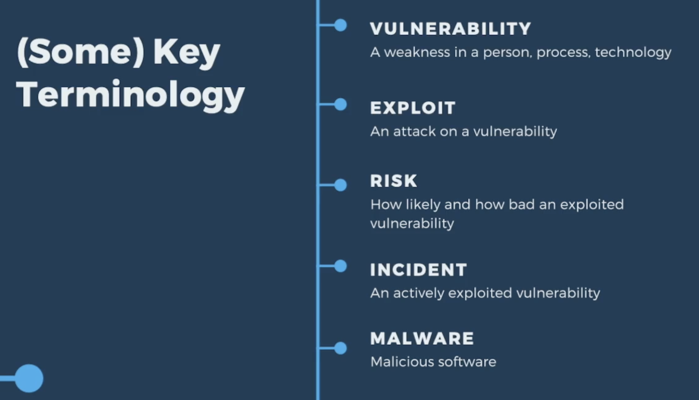
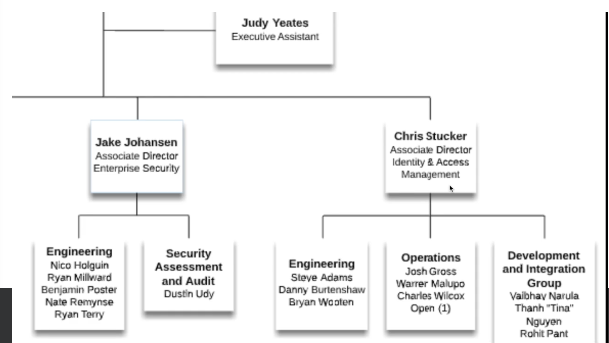
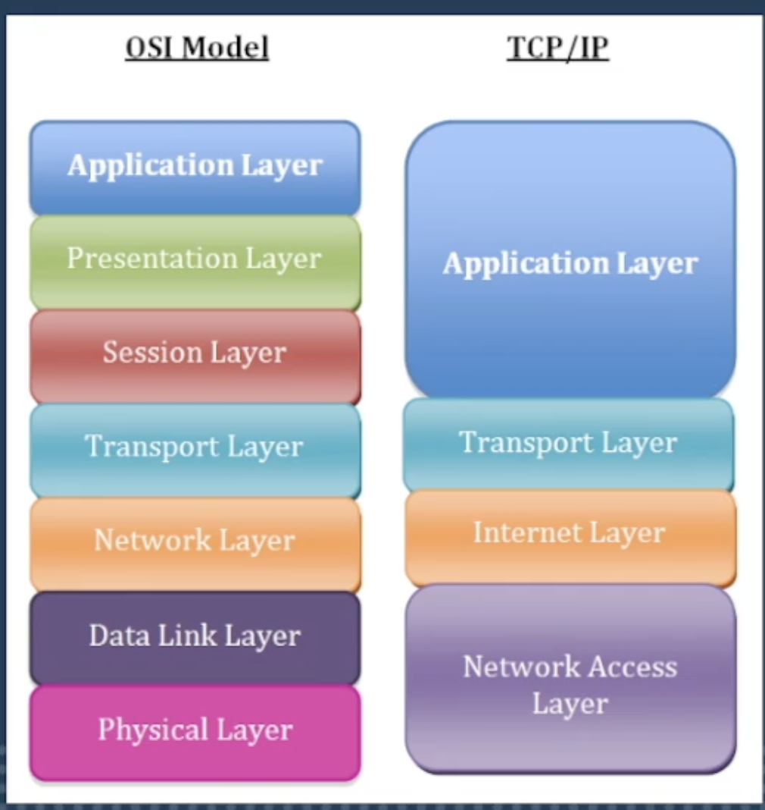
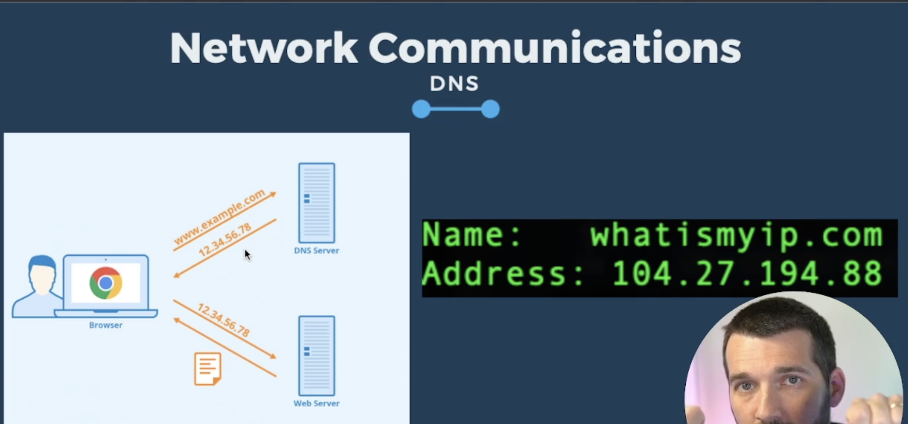
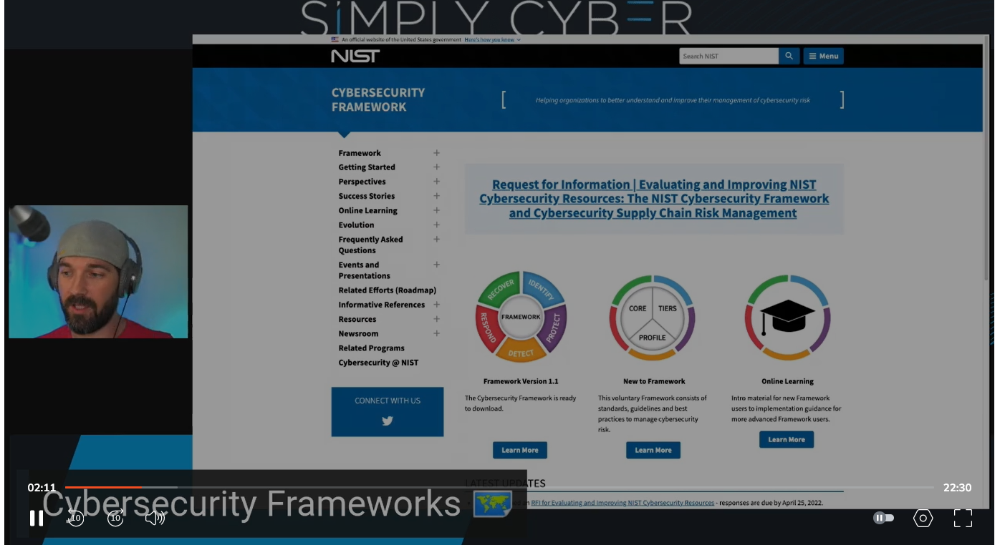
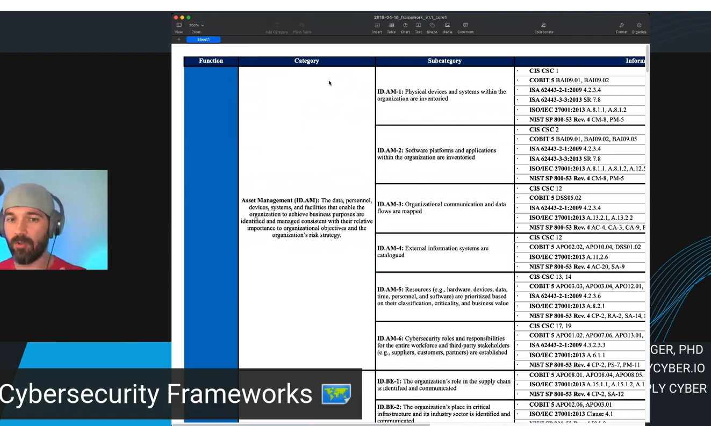
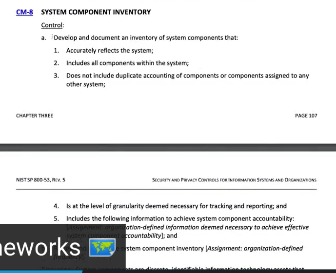
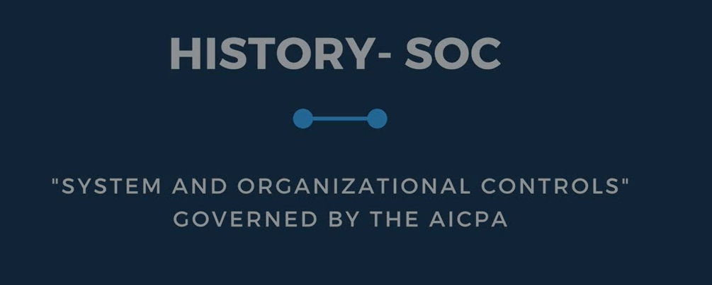
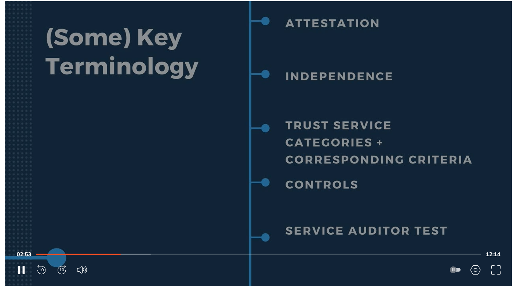
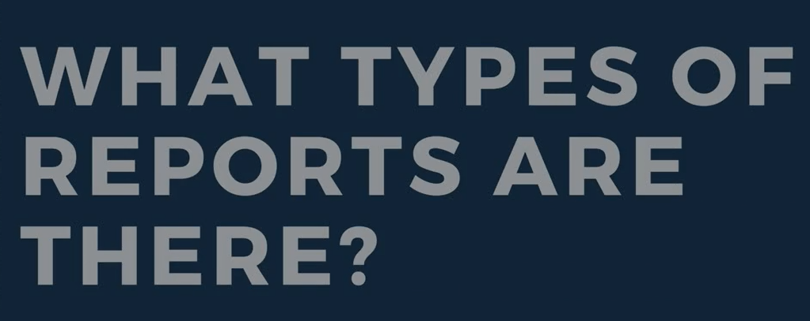

# The Definitive GRC Analyst Master Class

Link to Course: https://academy.tcm-sec.com/courses

## 0. Getting Started

**Course Objectives**

You might be wondering, what is this course going to do for me. Well I got you covered.

By the end of the course, students will be able to:

- Demonstrate core GRC Analyst capabilities including risk analysis, security awareness content creation, and audit
- Explain the structure and implementation of cybersecurity frameworks in an organization
- Identify how the GRC analyst contributes to an overall information security program
- Carry out an information security audit or assessment
- Build effective information security awareness content
- Utilize content to improve opportunities to discover and acquire a GRC analyst role

### 0.3 About Your Instructor

- Gerald Auger, PhD

## # 1. A Cybersecurity Primer

### Introduction

Cybersecurity Primer Module Objectives
By the end of this module, students will be able to:

- List key cybersecurity terminology
- Recognize servers, endpoints, and networking technology
- Explain the GRC analyst role and how it operates within an information security program
- Classify different types of threats based on threat actor

### 1.2 Cybersecurity Primer Baseline Assessment

You scored 3 / 5 (60%)

### 1.3 What is Cybersecurity?

### 1.4 What does a GRC Analyst do?

### 1.5 Where does a GRC Analyst Fit in the Cybersecurity Picture?

**A Symphony sounds lovely when all the pieces are playing their part.**
An effective cybersecurity program has many moving parts and GRC is but one. This lecture will outline where in the big picture GRC fits and how it interrelates with other functions.

### 1.6 Understanding Technology

### 1.7 Understanding Threats

- Enviroment: Natural Desasters (Tornado, Zunami, Wild Fire, Earthquake, Lava, Vulcan, Water Flooding)
- Technical Failure (Aircone breaks in Data Center)
- Human Threads

### 1.8 Quiz - Cybersecurity Primer

> You scored 9 / 10 (90%)

## 2. Compliance and Audit Work

### 2.1 Introduction

Compliance = Minimum Standart of Something (HIPA, GDPR, ...)

Audit (List of Controls / Interview Questions) = Validate Compliance

### 2.2 Compliance and Audit Baseline Assessment

>  60% right

### 2.3 Cybersecurity Frameworks

> Don't be intimated by the term framework. It's literally just a 
> previously vetted, comprehensive way of implementing a cybersecurity 
> program. See easy!

**NIST**

Left from Boom: Identifie and Protect

[The 18 CIS Critical Security Controls](https://www.cisecurity.org/controls/cis-controls-list)

### 2.4 Regulations and Compliance Standards

**Do I have to?**

A shorter module, but definitely important. 
Regulations force organizations to have cybersecurity. But why would 
they need to be forced and what regulations? Let's answer that in this 
lecture!

- Hipaa Complain (Health Care)

- Implement Security Controls 

- Complaince Requirements

### 2.4b SOC2 (Guest Lecturer)

SOC2 its a major player in the cybersecurity framework and standards space.

> Show SOC report with NDA

>  One who do SOC Report is independend from Company

>  Implmement Controls (You own Controls)

- SOC1 -> Financial Statement (As of <Date of Review>- End of Review)

- SOC2 -> Take SOC1 and add security criteria (Report over period of time (E.g. 1 Year) - Review every 6 Month)

- SOC3 -> On top create Report (Share Public Report without NDA)

- SOC2+ -> 

