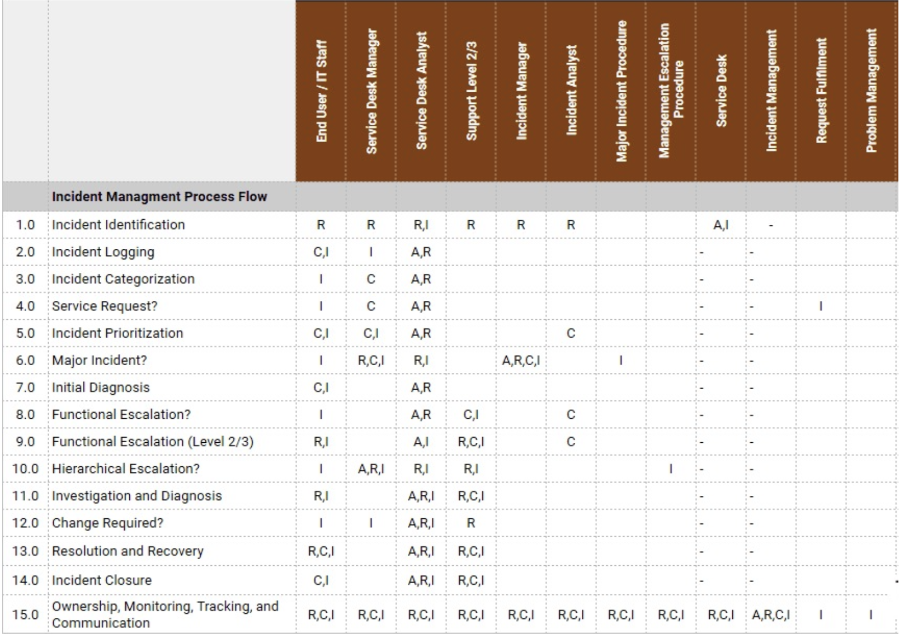

# Manage security incidents & Incident Response

[Source Presentation](https://import.cdn.thinkific.com/380432/courses/1359027/ForensicprinciplesandpoliciesLegalandregulatorycompliance-220429-102205.pdf)

## Table of Contents

- [Manage security incidents & Incident Response](#manage-security-incidents-incident-response)
  - [Table of Contents](#table-of-contents)
  - [Agenda](#agenda)
    - [Why do we need an IR plan](#why-do-we-need-an-ir-plan)
    - [Some regulations](#some-regulations)
    - [Legal considerations](#legal-considerations)
    - [Q&A from and for the CEO](#q-a-from-and-for-the-ceo)
    - [Questions you should focus on](#questions-you-should-focus-on)
    - [How to define an incident](#how-to-define-an-incident)
    - [Organization’s IR capabilities](#organization’s-ir-capabilities)
    - [Key components for IR plan](#key-components-for-ir-plan)
    - [Other key components for IR plan](#other-key-components-for-ir-plan)
    - [Writing the plan](#writing-the-plan)
    - [NIST framework](#nist-framework)
    - [IR Team access](#ir-team-access)
    - [IR Stakeholders](#ir-stakeholders)
    - [CEO’s support](#ceo’s-support)
    - [CSIRT team](#csirt-team)
    - [RACI for IR](#raci-for-ir)

## Agenda

* Preparing and Organizations for Incident Response
* Identifying Organizational Assets and Risk
* Protecting an Organization from an Incident
* Detecting the Incident
* Responding to an Incident
* Recovering from an Incident

### Why do we need an IR plan
* Your job... And basically everyone's job, depends on it.
* All companies have cybersec risk
* Regulations and laws require it
* It’s good for business
* To reduce impact and costs
* To set aside budget
* To understand and see your capabilities
* ... Can you think of more reasons?

### Some regulations
* PCI DSS
* HIPAA
* GDPR
* SOX

### Legal considerations
* Disconnect vs stay online
* Law enforcement
* Chain of custody
* Retention of records
* Privacy considerations

### Q&A from and for the CEO
* Ok... I know that I need an IR plan... What’s next?
* If an incident happens, what do we have to disclose? How do we handle that?
* How much will it cost?
* What did the attackers take? How did they got in?
* How long until we have full operations again?
* How can we prevent future incidents?
* How can we better prepared for future incidents?
* Who’s was/is the attacker? What’s the MOM?

### Questions you should focus on
* How do we manage the IR?
* What people and skills are needed?
* What technology is needed?
* How and what are we learning from previous incidents?

### How to define an incident
There is not easy/right answer for that. Each company can define an incident depending on their needs.

* Event
* Alert
* Small issue
* Big problem
* Confirmed breach

### Organization’s IR capabilities
1. Low maturity... No real capability
2. Moderate maturity... Some tools and skills
3. Mature

### Key components for IR plan
* Mission
* Goals
* Metrics
* Roadmap
* Organizational structure and responsibilities

### Other key components for IR plan
* Terminology
* Declaring an incident
* Roles
* Triage
* Communications
* Decisions to disconnect
* Recovery
* Lessons learned
* When to go back to main building

### Writing the plan
* W.O.R.N.
* Update
* Simple
* Store

### NIST framework
* Preparation
* Detection and analysis
* Containment eradication and recovery
* Post incident activity

### IR Team access
* Privileged accounts
* Policy
* Need to know and least privilege
* Monitoring

... quis custodiet ipsos custodes

### IR Stakeholders
* Auditors
* HR
* IT
* Chief executives
* Public affairs
* Legal
* Customers

### CEO’s support
Written policy is needed to give the security team the authority to implement controls and the visibility to get information needed.

### CSIRT team
* From 1 to multiple
* Remote work or on-site
* 24x7 or 8x5
* Outsourcing
* Reverse engineering
* Threat intelligence
* Forensics
* Threat hunting
* Programmers

### RACI for IR

